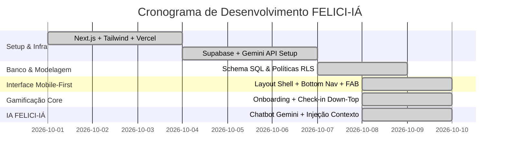

# 🚀 Documento de Kickoff de Projeto - FELICI-IÁ

> **Projeto:** FELICI-IÁ — Chatbot Gamificado e Educação Financeira Down-Top  
> **Público-Alvo:** Jovens Aprendizes do Senac  
> **Data de Início:** Outubro de 2026  
> **Versão:** 1.0.0  

---

## 1. Visão Executiva & Contexto do Negócio

O ingresso no mercado de trabalho através do programa de Aprendizagem Profissional (Senac e Empresas Parceiras) representa para muitos jovens o primeiro contato com renda própria e autonomia financeira. No entanto, diversos aprendizes enfrentam desafios de planejamento orçamentário e dificuldade em perceber a correlação direta entre assiduidade escolar/profissional e seu retorno financeiro mensal.

O **FELICI-IÁ** nasce com a missão de transformar a experiência do Jovem Aprendiz por meio de:
1. **Lógica Down-Top:** Quebra a visão abstrata do salário mensal em metas palpáveis por hora e por dia trabalhado/estudado.
2. **Gamificação com Registro Proativo:** O saldo não é passivo; o jovem desbloqueia suas conquistas e recompensas ao confirmar suas presenças no Senac e no trabalho.
3. **Inteligência Artificial Humanizada:** A persona **FELICI-IÁ**, alimentada pelo Google Gemini, orienta, educa, tira dúvidas pedagógicas e comemora cada marco atingido.

---

## 2. Objetivos Estratégicos (OKRs)

### Objetivo 1: Aumentar a taxa de assiduidade e pontualidade no programa Senac
* **KR 1.1:** Manter uma média de ofensiva (streak) ativa de pelo menos 15 dias consecutivos entre 70% dos usuários.
* **KR 1.2:** Reduzir faltas injustificadas no programa em 25% no primeiro trimestre de adoção.

### Objetivo 2: Desenvolver letramento financeiro prático no primeiro emprego
* **KR 2.1:** 80% dos aprendizes definirem e acompanharem sua Meta Financeira Mensal no Onboarding.
* **KR 2.2:** Mais de 60% dos aprendizes interagirem semanalmente com a FELICI-IÁ para tirar dúvidas sobre reserva de emergência e orçamento.

### Objetivo 3: Garantir experiência digital fluida e acessível (Mobile-First)
* **KR 3.1:** Tempo de carregamento inferior a 1.5s em conexões 4G móveis.
* **KR 3.2:** Deploy e disponibilidade contínua na Vercel com 99.9% de uptime.

---

## 3. Escopo do Projeto

### O que está no escopo (In-Scope)
- [x] Aplicação web responsiva (PWA/Mobile-First) desenvolvida em Next.js (App Router) + TailwindCSS.
- [x] Onboarding com definição de meta salarial e escala semanal (Senac vs. Empresa).
- [x] Cards de missões diárias com cálculo da taxa diária Down-Top e bloqueio de duplicidade.
- [x] Bottom Navigation com telas de Início, Carteira (Extrato) e Perfil.
- [x] Botão Flutuante (FAB) da FELICI-IÁ com efeitos visuais e micro-interações.
- [x] Interface de Chatbot (estilo WhatsApp) com histórico, sugestões rápidas e markdown.
- [x] Integração da API do Google Gemini com injeção de contexto (`regras_senac.md` + status do usuário).
- [x] Modelagem relacional e políticas RLS no Supabase.

### O que está fora do escopo inicial (Out-of-Scope)
- Integração bancária direta via Open Finance ou Pix real (o saldo é educacional/gamificado).
- Sistema de ponto eletrônico com geolocalização ou reconhecimento facial (substitui a confiança pelo foco pedagógico).

---

## 4. Matriz de Stakeholders e Papéis

| Papel | Responsabilidade |
| :--- | :--- |
| **Product Manager (PM)** | Definição da visão, priorização do backlog de épicos e alinhamento pedagógico. |
| **Tech Lead / Engenharia** | Arquitetura técnica (Next.js, Supabase, Gemini, Vercel), segurança de dados e deploys. |
| **Design / UX** | Design system mobile-first, identidade visual da FELICI-IÁ, micro-interações e usabilidade. |
| **Pedagógico Senac** | Validação das regras do programa aprendiz, carga horária e diretrizes de convivência. |
| **Jovens Aprendizes** | Usuários finais, fornecendo feedback contínuo sobre engajamento e usabilidade. |

---

## 5. Cronograma e Entregas dos Épicos

---

## 6. Riscos Mapeados e Planos de Mitigação

| Risco | Probabilidade | Impacto | Plano de Mitigação |
| :--- | :---: | :---: | :--- |
| Usuário esquecer de registrar o check-in | Média | Médio | Notificações no app e flexibilidade para justificativas. |
| Tentativa de registrar múltiplos check-ins no mesmo dia | Alta | Baixo | **Bloqueio de duplicidade** ativo no frontend e constraint `UNIQUE` no banco. |
| Limite de requisições / Rate limit da API Gemini | Baixa | Médio | Sistema de fallback gracioso integrado na rota `/api/chat`. |
| Falta de credenciais Supabase/Gemini no primeiro teste | Alta | Baixo | Persistência local (`LocalStorage`) e mock funcional pré-configurado. |
